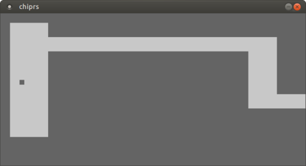
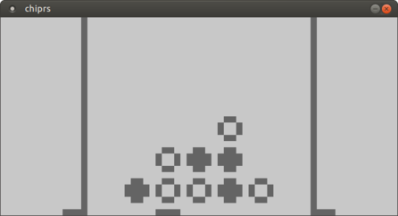

# `chiprs` - a CHIP-8 emulator in Rust

This is a simple project I'm writing to teach myself Rust.
[CHIP-8](https://en.wikipedia.org/wiki/CHIP-8) is a virtual machine from the
1970s, used for running simple games. Here's the [CHIP-8 technical specification](http://devernay.free.fr/hacks/chip8/C8TECH10.HTM).

## Directory structure

* [`chiprs/`](chiprs) - emulator engine
* [`chiprs-sdl/`](chiprs) - SDL emulator
* [`games/`](games) - game ROMs, taken from http://devernay.free.fr/hacks/chip8/

## Usage

You need to [install Rust and Cargo](https://rustup.rs/). You'll also need the
SDL2 library (something like `libsdl2-dev`).

    cd chiprs-sdl
    cargo run ../games/<game>.ch8

The keyboard layout is:

|    |    |    |    |
|--- |--- |--- |--- |
| 1  | 2↑ | 3  | C  |
| 4← | 5  | 6→ | D  |
| 7  | 8↓ | 9  | E  |
| A  | 0  | B  | F  |

## License

By Paweł Marczewski <pwmarcz@gmail.com>.

Licensed under MIT (see [`LICENSE`](LICENSE)), except the `games` directory.
